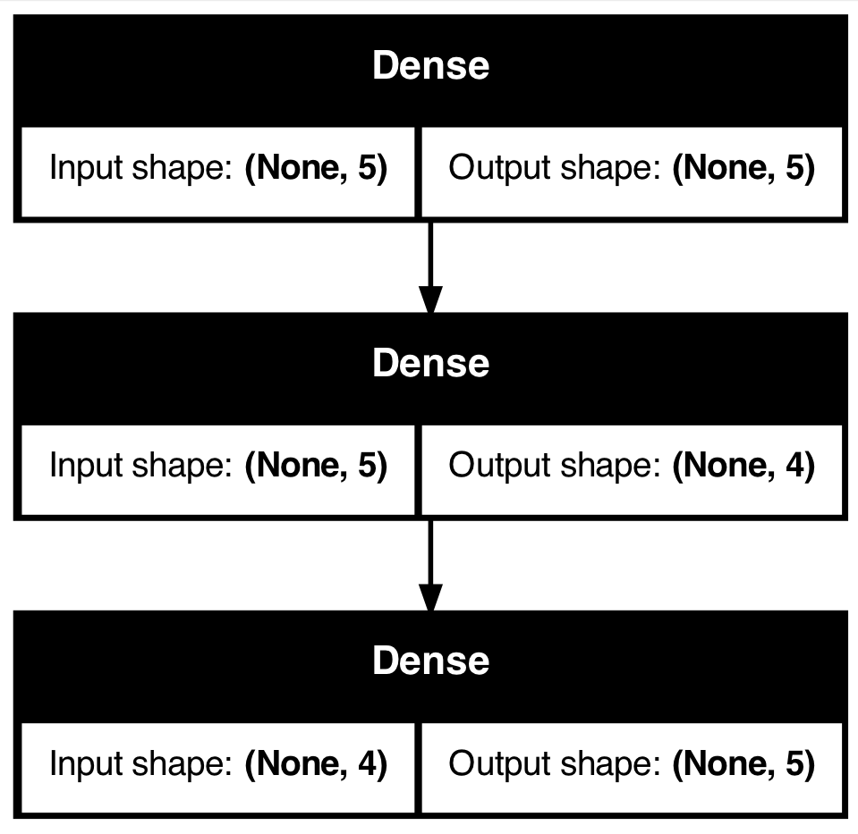

<head>
  <link rel="stylesheet" href="assets/styles/styles.css">
</head>

### **Portfolio**

---

### Data Science & Machine Learning Projects

#### [Drug Type Classification Using Neural Networks](./project-drug-classification/project-details.md)

  
  

Developed a neural network model in Python to classify drug types based on patient data. The dataset included features such as age, gender, blood pressure levels, cholesterol levels, and the sodium-to-potassium ratio. Key highlights of the project:

- Achieved **95% accuracy** in classifying drug types.
- Focused on optimizing recall and F1-scores for multi-class classification.
- Leveraged a dense neural network with activation functions optimized for performance.

**Insights:**
- High sodium-to-potassium ratios strongly correlated with Drug Type X.
- Patients with normal blood pressure and high cholesterol were likely to be prescribed Drug Type Y.
- Gender showed minimal impact on drug classification.

**Key Tools Used:**
- Python
- TensorFlow/Keras
- Matplotlib and Seaborn for data visualization

- [View Project Details](./project-drug-classification/project-details.md)
- [View Jupyter Notebook](./project-drug-classification/project-drug-classification.html)

---
[Project 2 Title](/pdf/sample_presentation.pdf)

---
[Project 3 Title](http://example.com/)

---
 
### Category Name 2

- [Project 1 Title](http://example.com/)
- [Project 2 Title](http://example.com/)
- [Project 3 Title](http://example.com/)
- [Project 4 Title](http://example.com/)
- [Project 5 Title](http://example.com/)

---

---

Page template forked from <a href="https://github.com/evanca/quick-portfolio">evanca</a>

<!-- Remove above link if you don't want to attibute -->
