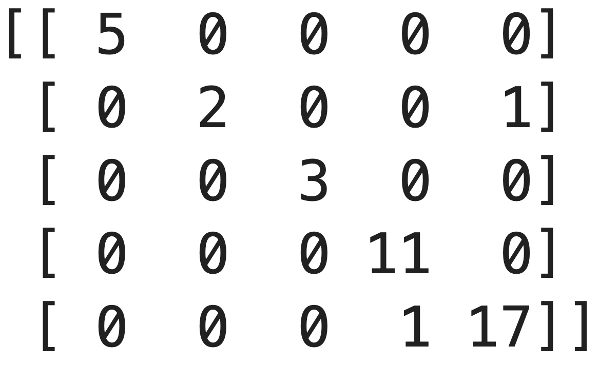

<head>
  <link rel="stylesheet" href="assets/styles/styles.css">
</head>

### **Portfolio**

---

### Data Science & Machine Learning Projects

#### [Drug Type Classification Using Neural Networks](./project-drug-classification/project-details.md)

  
  

Developed a neural network model in Python to classify drug types based on patient data. The dataset included features such as age, gender, blood pressure levels, cholesterol levels, and the sodium-to-potassium ratio. Key highlights of the project:

- Achieved **95% accuracy** in classifying drug types.
- Focused on optimizing recall and F1-scores for multi-class classification.
- Leveraged a dense neural network with activation functions optimized for performance.

**Insights:**
- High sodium-to-potassium ratios strongly correlated with Drug Type X.
- Patients with normal blood pressure and high cholesterol were likely to be prescribed Drug Type Y.
- Gender showed minimal impact on drug classification.

- [View Project Details](./project-drug-classification/project-details.md)
- [View Jupyter Notebook](./project-drug-classification/project-drug-classification.html)

---

#### [Credit Default Prediction Model](./project-credit-default/project-details.md)

  
  

Developed a **logistic regression model** to predict credit defaults based on applicant financial data. The dataset included 1,000 records with features such as income percentage, loan amount, age, and account balances.

**Key highlights:**
- Optimized for minimizing **false negatives** due to the financial impact of incorrectly approving risky loans.
- Improved recall for detecting defaults by 19% through **SMOTE oversampling**.
- Achieved an ROC-AUC score of **0.79**.

**Insights:**
- Higher loan amounts and lower credit history quality were the strongest predictors of defaults.
- Missing account balances were indicative of lower default risk, possibly due to wealthier applicants.

- [View Project Details](./project-credit-default/project-details.md)
- [View Jupyter Notebook](./project-credit-default/project-credit-default.html)

---

### Category Name 2

- [Drug Type Classification Using Neural Networks](./project-drug-classification/project-details.md)
- [Credit Default Prediction Model](./project-credit-default/project-details.md)
- [Project 3 Title](http://example.com/)
- [Project 4 Title](http://example.com/)
- [Project 5 Title](http://example.com/)

---

Page template forked from <a href="https://github.com/evanca/quick-portfolio">evanca</a>

<!-- Remove above link if you don't want to attribute -->
